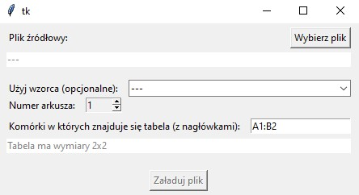
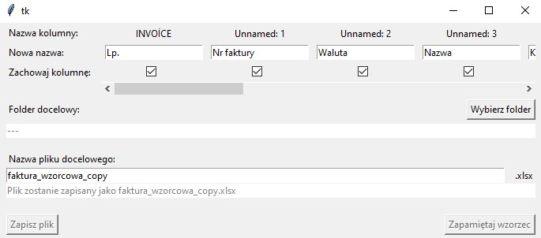
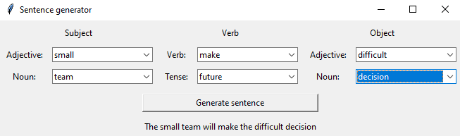
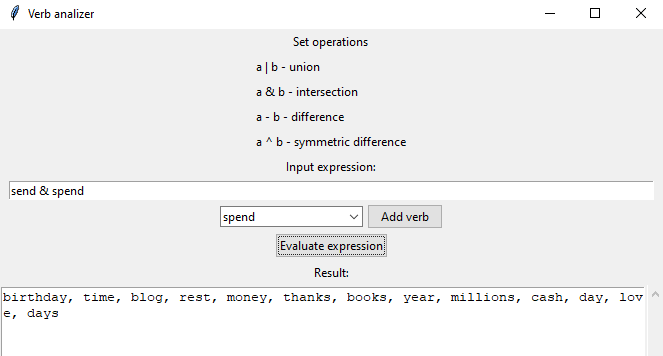

# TK-GUIs
A collection of TKInter GUIs I made for small projects.

## Wallpapers

A crude app that can be used to turn Movie and TV Show screenshots into wallpapes. TKInter is used to preview the wallpaper in fullscreen and move it around so the user can cut out the desired part of the image.

## Excel

GUI for a script to clean and transform tabular data in Excel. Makes use of a scrollable frame to display any amount of column headers. (GUI only)

|  |  |
|-|-|

## NLP

Small apps made in collaboration with [miskrz0421](https://github.com/miskrz0421) for the Natural Launguage Processing university course.

|  |  |
|-|-|
